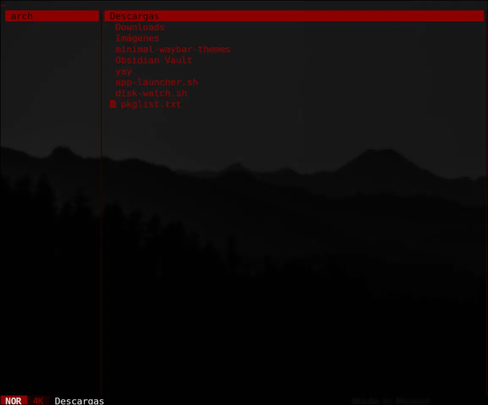
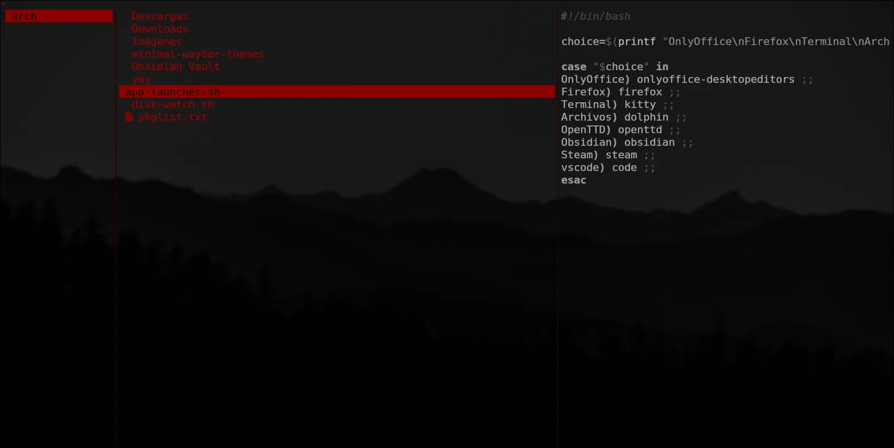

# sangre-negra.yazi

Tema oscuro para [Yazi](https://github.com/sxyazi/yazi) basado en una paleta de **negro puro y rojo vino**. Sin pasteles, sin Catppuccin, sin colores genéricos.

## Vista previa




## Colores

| Elemento | Color |
|---|---|
| Carpetas | Rojo vino `#8b0000` |
| Archivos de texto y código | Rojo vino `#8b0000` |
| Ejecutables | Rojo sangre `#c0392b` |
| Comprimidos | Rojo brillante `#c0392b` |
| Imágenes | Café `#a0522d` |
| Audio / Video | Rojo oscuro `#922b21` |
| Syntax highlighting | Grises oscuros |
| Fondo | Negro puro |

## Requisitos

- [Yazi](https://github.com/sxyazi/yazi) v0.2.4 o superior
- Una [Nerd Font](https://www.nerdfonts.com/) instalada en tu terminal (opcional, para íconos)

## Instalación

```bash
# Crear la carpeta de flavors si no existe
mkdir -p ~/.config/yazi/flavors

# Clonar el repositorio
git clone https://github.com/pitertapia884-commits/sangre-negra.yazi ~/.config/yazi/flavors/sangre-negra.yazi
```

Luego edita tu `~/.config/yazi/theme.toml` y agrega:

```toml
[flavor]
dark  = "sangre-negra"
light = "sangre-negra"
```

Reinicia Yazi y listo.

## Desinstalación

Borra la carpeta del flavor y elimina las líneas de `theme.toml`:

```bash
rm -rf ~/.config/yazi/flavors/sangre-negra.yazi
```
